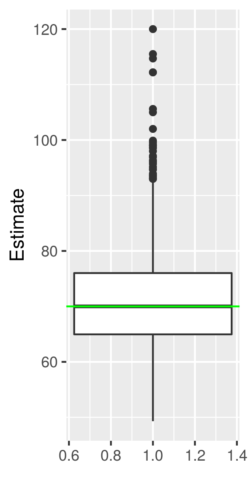

# IBIO891 Mark and Recapture Supplement

## Contents
  - Simulation & analysis code for cheatsheet case study
  - Simultation & analysis code for presentation case study
  
## Cheatsheet Case Study
The cheeatsheet itself can be found here: [https://docs.google.com/document/d/1JAv4nybSPdbd6zwHVphWVLkNxjPORykhpa1F79Fc9Vg/edit?usp=sharing](https://docs.google.com/document/d/1JAv4nybSPdbd6zwHVphWVLkNxjPORykhpa1F79Fc9Vg/edit?usp=sharing)

The details of the experiement can be found in the cheatsheet. In short, we simulated "subjects" as circles zipping around the screen. A trap is used to sample the subjects that overlap with it. By doing this twice we have all the data necessary to use Lincoln-Petersen methods for estimating the total population size. 

Here's a screenshot:

To run: 
  - Download the code, either as a zip or using git
  - Run "python3 main.py" in the directory
  - Note: pygame is optional. You can edit the constant DO_VISUALS in constants.py. If this is false, pygame will not be required, but there will be no visualization. 
  - There are many tunable parameters in constants.py if you wish to play around!
  
Just for fun, here is the histogram (generated by analysis.r) for the data in ./output. These data were generated for the cheatsheet linked above. 

Running this anaylsis script requires ggplot2 and it will require you to change the setwd(...) line. 

## Presentation Case Study
For our actual presentation, I elected to do an activity in which we are estimating the size of the class. Our presentation, and my goofy case study flavor text, can be found here: 
[https://docs.google.com/presentation/d/1lGr-2xDMIPcTIPi6017sl1whqwSihGENDcvy_CE-dcc/edit?usp=sharing](https://docs.google.com/presentation/d/1lGr-2xDMIPcTIPi6017sl1whqwSihGENDcvy_CE-dcc/edit?usp=sharing)

The code runs 1000 simulations of the in class exercise.
To run, simply edit ForClass.r to change the setwd() line to whatever is appropriate for you! It should generate a nice boxplot like so: 

Cheers!
